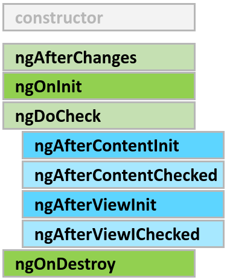

# udemy-angular-course

## 1. Getting Started

> What is angular? \
> Its a javascript framework which allows you to create single page applications (SPAs) \
> Page never reloads - it make changes to currently loaded pages

-   Angular Versioning -
    -   AngularJS (Angular 1) (Very Different) (Can ignore)
    -   Angular 2
    -   Angular 4 (Angular 3 was skipped)
    -   Angular 10, 11, 12....
    -   (They release major version every 6 months but all of them backwards compatible except Angular1)

> Node is used to run the Angular app
> npm is used to manage different dependencies in an Angular project

-   Install Angular Globally

```
$ sudo npm install -g @angular/cli@latest
```

-   First Angular App

```
$ ng new 01-my-first-app --strict false
$ cd 01-my-first-app
$ ng serve
```

## 2. The Basics

### Components

-   Adding Bootstrap to Angular App

```
$ cd 02-angular-basics
$ npm install --save bootstrap

Go to file "angular.json" :
02-angular-basics.architect.build.options.styles ->
add "node_modules/bootstrap/dist/css/bootstrap.min.css"
```

-   How and Angular App Gets Loaded And Started

> index.html - has -> \
> different scripts tags embedded - starts -> \
> main.ts - bootstrap -> \
> app.module.ts - analyzes -> \
> app.component.ts - reads -> \
> app.component.html - knows -> \
> app-root

-   Components are important

    1.  app-root : main component where it all starts
    2.  angular app is built with component
    3.  each component has -
        -   template , html code
        -   styling
        -   business logic

-   Creating a new Component
-   Understanding role of App Module and Component
-   Using Custom Components
-   Creating components with CLI and nesting components

```
$ cd 02-angular-basics
$ ng generate component servers OR $ ng g c servers
```

-   Working with component templates
    1. either template pr templateUrl needs to be present in component decorator
    2. called inline or external templates
-   Working with component styles
    1. inline styles - styles : in component decorator
    2. external styles - styleUrls : file names of the css files
    3. inline styles > external styles
-   Fully understanding the component selector
    1. attribute style - selector : "\[name\]"
    2. class selector - selector : ".name"
    3. cannot use id selector and pseudo-selectors (like :hover etc.)
-   Practicing Components Exercise

### Data Binding

-   What is data-binding?
    1. communication between typescript code and html templates and other way around
-   String Interpolation : {{}}
-   Property Binding : []
-   Property Binding Vs String Interpolation
    1. output something - use string interpolation
    2. change some property - use property binding
-   Event binding : ()
-   Passing and Using Data with Event Bindings : $event
-   Two Way Data Binding : [(ngModel)]
-   Combining all forms of data-binding

### Understanding Directives

-   Directives instructions in the DOM for angular
-   Components are directives with templates
-   Built in Directives
    1. \*ngIf - expression
    2. ngStyle - use property binding
    3. ngClass - use property binding
    4. \*ngFor - let <item> of <items>; let i = index

( \* in the beginning means - structural directives that changes DOM )

## 3. Course Project - The Basics

About : Recipe Book and Shopping List App

### Planning the app


### Creating the new Project

```
$ ng new 99-course-project-app --no-strict --routing false --standalone false

$ 99-course-project-app

$ npm install --save bootstrap@3

Put the Path in angular.json under :
  projects >  99-course-project-app > architect > options > styles

"node_modules/bootstrap/dist/css/bootstrap.min.css"
```

### Creating the Components

```
$ ng g c components/header --skip-tests
$ ng g c components/recipes --skip-tests
$ ng g c components/recipes/recipe-list --skip-tests
$ ng g c components/recipes/recipe-detail --skip-tests
$ ng g c components/recipes/recipe-list/recipe-item --skip-tests
$ ng g c components/shopping-list --skip-tests
$ ng g c components/shopping-list/shopping-edit --skip-tests
```

### Using and Arranging The Component

### Components Coding

1. Header Component
2. Recipe Model
3. Adding Recipes Content
4. List of Recipes
5. Recipe Details
6. Shopping List Features
7. Ingredients Model
8. Shopping List Edit

## 4. Debugging

-   Read and use the Error Messages to fixe compilation bugs
-   To Debug js files have map to the ts files
-   They exists in developer tools > sources > webpack:// > "." > src > same folder structure as your project

## 5. Components and Data Bindings

### Splitting App into components

### Property and Event Binding

-   Custom property binding : inside the component

    -   @Input() decorator : to allow parent component to set the property of the child component
    -   @Input('<property-alias>') : <property-name> will be available to parent component to bind

-   Custom property binding : from the component
    -   EventEmitter<data-type>() : to create custom event properties
    -   @Output() decorator : to send the event outside the component (to the parent specifically)

### View Encapsulation

-   Angular adds a unique id to each component element so that it can be differentiated from others and can be selected separately from the CSS file
-   encapsulation: ViewEncapsulation - .Emulated, .None, ,.ShadowDom

### Using Local References in Templates

-   <input type="text" class="form-control" [(ngModel)]="newServerName" /> change to -
    <input type="text" class="form-control" #serverNameInput/>
-   serverNameInput is the whole HTMLInputElement with all the properties

### Getting Access to Component Templates from Typescript

-   Add local reference to the element
-   @ViewChild(<local-reference>) serverContentInput: ElementRef; - you get ref to that element from the template

### Projecting Content With ngContent

-   ngContent - hook to mark a place in your component to add the data between the selector tags where the component was used

### Understanding Component Lifecycle

-   Lifecycle Hooks : The stages of angular creating a new component

    1.  ngOnChanges(changes: SimpleChanges)
        -   can be executed multiple times : on comp init, bound property change @Input decorators
    2.  ngOnInit
        -   after basic init, component is not added to the DOm yet
    3.  onDoCheck
        -   every change detection run (timer, button click etc.)
    4.  ngAfterContentInit
        -   after content ng-content has been rendered
    5.  ngAfterContentChecked
        -   every time ng-content has been checked
    6.  ngAfterViewInit
        -   after components view and child views has been initialized
    7.  ngAfterViewChecked
        -   every time the view and the child view have been checked
    8.  ngOnDestroy
        -   before the component object is getting destroyed

    

### LifeCycle Hooks and template Access

-   @ViewChild and @ContentChild will not have any values till ngAfterViewInit and ngAfterContentInit is called respectively

## 6. Course Projects - Components and Data Bindings

TODO

## 7. Directives Deep Dive

### Understanding Directives

-   types

    1. Attribute - only change properties of the element applied
    2. Structural - changes structure of the element in the dom applied

-   ngIf and ngFor (Structural)
-   ngClass and ngStyle (Attribute)

### Custom Attribute Directive

-   @Directive decorator - it needs selector : [] for attribute
-   using ElementReference :
    -   constructor(private elementRef: ElementRef) {} : injection of the element on which the directive is used ; its reference
    -   it will now be accessible in the component class
    -   `ng g d directives/better-highlight --skip-tests` : to create new highlight
-   using Renderer2 :
    -   constructor(private elementRef: ElementRef, private renderer: Renderer2) {}
    -   this.renderer.setStyle()
-   @HostListener decorator:
    -   to listen to the dom events on the element
-   @HostBinding
    -   used to bind an element property to your class property
-   Providing Inputs to the directives
    -   we can use custom property binding or event binding on the directives to send data to it

### Custom Structural Directive

-   <ng-template [ngIf]="onlyOdd"> can be used to replicate \*ngIf directive
-   This can be used to set up our own structural directive
-   @Input() set appUnless(condition: boolean) : to define the directive function
-   constructor(
    private templateRef: TemplateRef<any>, : getting the element we want to change
    private viewContainerRef: ViewContainerRef : getting the place we want to add or remove the element of the DOM
    )

### ngSwitch directive

-   works as a switch case statement in java
-   [ngSwitch]="<variable-name>" for the main element to provide the variable name
-   \*ngSwitchCase="<variable-value>"
-   \*ngSwitchDefault = default case if value is not in the other cases

## 8. Course Project - Directives

TODO

## 9. Using Services and Dependency Injection

### Services

-   Used to centralize the functionality that can be shared by all the components
-   How to create a logging service - its just a simple typescript class

### Dependency Injections

-   Using Providers
    -   add class entry to the component decorators under providers array
    -   add a variable to the constructor of the service type
-   Using Angular's inject function
    -   inside constructor use thi.loggingService = inject(LoggingService)
-   Hierarchical Injector
    If we added service providers to the following :
    -   AppModule - service instance is available same instance application wide
    -   AppComponent - service instance is available for all components but not service
    -   Any Other Component - the same instance is available for components and all its child component
-   @Injectable() decorator : added to the services where we wanna inject other services
-   Also make sure that you add providers on AppModule
-   You can also use "providedIn: 'root'" property on Injectable decorator

## 10. Course Project - Services and Dependency Injection

TODO

## 11. Changing Pages with Routing

### Import Routing to the angular path

-   add appRouts: Routs array to the App Module file, each rout will be connected to an Angular Component
-   Register the appRoutes with RouterModule.forRoot(appRoutes)

### Using the routes in the templates

-   <router-outlet></router-outlet> : to mark the position where you want the output of the routes
-   routerLink : to add the link in your page which loads without a page refresh
-   relative path vs absolute path (each component sits at '/' "root" path)
-   you can use relative directory path conventions as well ./, ../ etc.
-   routerLinkActive : to add some class to an element to indicate that route is currently active
-   routerLinkActiveOptions : to add some configuration for routerLinkActive {exact: true} : makes it read the complete path before applying routerLinkActive

### Navigating Programmatically

-   inject router to your component : constructor(private router: Router) {}
-   this.router.navigate(["/servers"]): to navigate from the component
-   unlike routerLink , navigate() doesn't know on which route we are currently on
-   ActivatedRoute : inject this int your component to use the current route of your app in the component
-   this.router.navigate(["servers"], { relativeTo: this.currentRoute }) : to navigate relative to current route from the code

### Passing Parameters to the routes

-   { path: "users/:id", component: UserComponent } : to add a dynamic parameter on the route
-   ActivatedRoute : inject this int your component to use the current route of your app in the component
-   this.route.snapshot.params["id"] : to access the parameter on the ActivatedRoute
-   But this is locked in place when the component is loaded for that route
-   this.route.params.subscribe((params: Params) => {}) : to subscribe to a param change event on ActivatedRoute
-   angular destroys subscription on its own when the component is destroyed (you can do it on your own as well)

### Query Parameters and Fragments on the Routes

-   [queryParams]="{ allowEdit: '1' }" : to add query ? on the routerLink
-   fragment="" : to add fragment # on the router link
-   this.router.navigate(["/servers", id, "edit"], {
    queryParams: { allowEdit: "1" },
    fragment: "loading",
    });
-   same but with navigate function from the component
-   this.route.snapshot.queryParams / fragment to access the same in component code accessed from ActivatedRoute
-   OR this.route.queryParams.subscribe() / this.route.fragment.subscribe() : subscribe to the observables

### More Routes

-   Child Route
    -   children: [] : to add nested routes to your already existing route
-   Redirects
    -   redirectTo: if you wanna redirect to some other existing route
-   wildcard path
    -   "\*\*" - matches all possible routes
    -   but it should be added after your other routes in the appRoutes array
-   Outsourcing the routes
    -   You can create a app-routing module for storing all your routes
    -   you need to export the appRout array from that module and import it to your App Module
-   rout fallback
    -   imports: [RouterModule.forRoot(appRoutes, { useHash: true })], to use # inside your routes

### Route Guards

-   code executed before the route is loaded
-   canActivate guard
    -   You need to have two services
        1. a Guard Providing service
        2. some kind of authentication service
    -   Auth service should be injected to the AuthGuard service and it should return a boolean - promise, subscription or literal to tell if the route can be activated or not
    -   You can register both of those in AppModule and add canActivate array on the path you want to apply the AuthGuard to
-   canActivateChild guard
    -   the same type of interface as canActivate
    -   this will only protect the child routes of the path
-   canDeactivate guard
    -   it is used when you want to leave the route
    -   angular execute it before going from the protected page to somewhere else

### Passing Static/Dynamic Data to Routes

-   static data

    -   data: { <some-data> } : add this to your route object to pass the data to the route component
    -   this.errorMessage = this.route.snapshot.data["message"];
    -   this.route.data.subscribe((data: Data) => {});

-   dynamic data
    -   we need to implement a Resolver Service; Resolve interface from angular
    -   then register it to the AppModules providers
    -   Use that in the App Routing Module to add custom dynamic data using :
        -   resolve: { server: ServerResolver } on the route you want
    -   you can access that :
        -   this.route.snapshot.data["server"]
        -   this.route.data.subscribe((data: Data) => {})

### Setting up Child Routes

## 12. Course Project - Routing

TODO

## 13. Understanding Observables

### What is an Observable

-   a data-source : rxjs
-   Observable pattern :
    -   we have an observable and an observer and in between we have a stream of timeline
    -   during this timeline the observable emits events/data packets depending upon its data source
    -   example - button click, http request
-   Observer : its your code
    -   3 ways of handling the data
        1. Handle actual data
        2. Handle error
        3. Handle completion (it can never complete as well)
-   used to handle async tasks
-   it is an alternative to Promises, Callbacks
-   Major advantage :
-   Observable is a part of module RxJS we need to install it to create our own observable

### Subscribing, Unsubscribing observable

-   to subscribe to an observable means start listing to it, whatever data it returns
-   .subscribe(<callback>) method on observable is way to do it; it will return a Subscription object
-   that object .unsubscribe() will stop the listening
-   Observables provided by Angular will be unsubscribed by angular itself

### Custom Observable

-   Observable.create((observer) => {})
-   then we can use :
    -   observer.next() : to send next data packet
    -   observer.error() : to send error event
    -   observer.complete() : to send complete event
-   in subscribe : we can pass 3 callbacks to run when above three events occurred respectively

### Operators

-   build in data transformation that can be used between observables and subscription not after the subscription
-   observable.pipe() method
-   it takes operator inputs; that is functions from rxjs/operators module
-   for example - map, filter etc.
-   [RxJS Documentation](https://rxjs.dev/api)

### Subjects

-   is a type of observable we can use
-   it is an "Active" observable
-   it doesn't need a callback, instead we can call next, error or complete functions on it
-   used ot emit your custom events and then subscribe to it
-   to communicate across component using the services

## 14. Course Project - Observables

TODO

## 15. Handling Forms in Angular Apps

### Angular Forms

-   angular helps :
    -   getting values from the form
    -   validate the values
    -   angular gives javascript object representation with name values of fields and metadata about the forms
-   approaches :
    -   template driven - angular infers from object from the DOM
    -   reactive object - thr form is created programmatically and synchronized with the DOM

### Template Driven Forms

-   creating from and registering controls
    -   FormsModule import and register in the AppModule
    -   Angular will automatically create a JS object from the html form defined in the template
    -   for angular to add your input as a filed in Forms Object add - ngModel name="<field-name>" : input will be added by field-name
-   Make form Submittable
    -   add (ngSubmit)="onSubmit()" on form tag
-   access forms data as JS Object
    -   (ngSubmit)="onSubmit(f)" #f="ngForm"
    -   the f is NgForm object that will have all the data from the form
    -   Or you can use @ViewChild() on a component parameter to bind the #f from the component
    -   you can add : #email="ngModel" to specific input to access that as a FormControl object
-   Form State
    -   metadata about the form : example - valid, invalid, dirty, controls
-   Form Validations
    -   for template driven forms angular needs directives
    -   [Validation Documentation](https://angular.io/api?type=directive)
-   Styling form based on validations
    -   disable the submit button : [disabled]="!f.valid"
    -   css classes - [Validation CSS Classes Doc](https://angular.io/guide/form-validation#control-status-css-classes)
-   Setting default values
    -   [ngModel]="'pet'" : using one way property binding on ngModel on an input element
-   Instantly react to form inputs
    -   [(ngModel)]="answer" : using two way property binding on ngModel on an input element
-   creating groups of form control
    -   ngModelGroup="userData" to the div containing all the desired form controls
    -   userData will be added as a separate form control in the form object
-   setting and patching form values
    -   setValue({}) on NgForm object to set the complete form
    -   form.patchValue({}) on NgForm object to only update the mentioned values
-   You can access the value property on the form to access its value object of all the fields
-   Resetting the form
    - 

## 16. Course Project - Forms

TODO

## 17. Using Pipes to Transform Output

## 18. Making HTTP requests

## 19. Course Project - HTTP

TODO

## 20. Authentication & Route Protection in Angular

## 21. Dynamic Components

## 22. Angular Modules and Optimizing Angular Apps

## 23. Deploying an Angular App

## 24. Standalone Components

## 25. Angular Signals

## 26. Bonus: Using NgRx For State Management

## 27. Bonus: Angular Universal

## 28. Angular Animations

## 29. Adding Offline Capabilities with Service Workers

## 30. A Basic Introduction to Unit Testing Angular Apps

## 31. Angular as a Platform & Closer Look at the CLI

## 32. Angular Changes and New Features

## 33. Course Roundup

## 34. Bonus: TypeScript Introduction (for Angular2 Usage)
