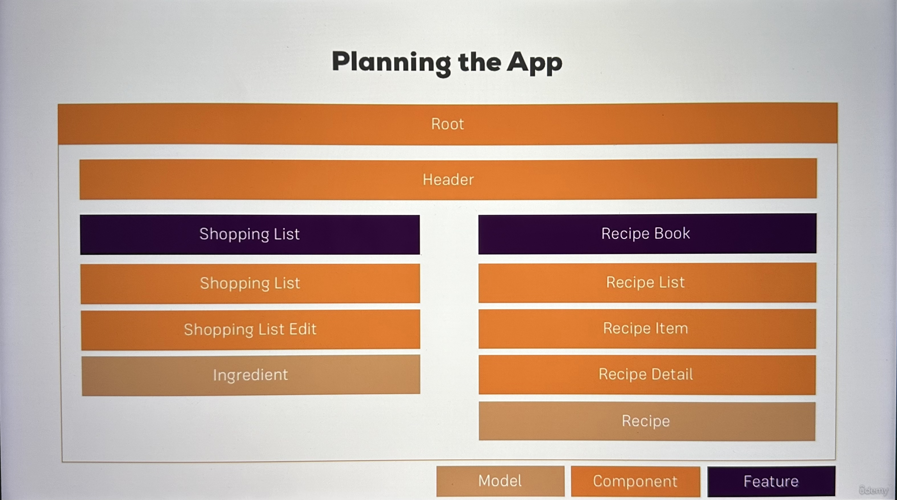

# udemy-angular-course

## 1. Getting Started

> What is angular? \
> Its a javascript framework which allows you to create single page applications (SPAs) \
> Page never reloades - it make changes to currently loaded pages

-   Angular Versioning -
    -   AngularJS (Angular 1) (Very Different) (Can igonre)
    -   Angular 2
    -   Angular 4 (Angular 3 was skipped)
    -   Angular 10, 11, 12....
    -   (They release major version every 6 months but all of them backwords compatible except Angular1)

> Node is used to run the Angular app
> npm is used to manage differrent dependancies in an Angular project

-   Install Angular Globally

```
$ sudo npm install -g @angular/cli@latest
```

-   First Angular App

```
$ ng new 01-my-first-app --strict false
$ cd 01-my-fisrt-app
$ ng serve
```

## 2. The Basics

### Components

-   Adding Bootsrap to Angular App

```
$ cd 02-angular-basics
$ npm install --save bootstrap

Go to file "angular.json" :
02-angular-basics.architect.build.options.styles ->
add "node_modules/bootstrap/dist/css/bootstrap.min.css"
```

-   How and Angular App Gets Loaded And Started

> index.html - has -> \
> different scripts tags embedded - starts -> \
> main.ts - bootstrap -> \
> app.module.ts - analyzes -> \
> app.component.ts - reads -> \
> app.component.html - knows -> \
> app-root

-   Components are important

    1.  app-root : main coponent where it all starts
    2.  anugular app is bult with compontnts
    3.  each component has -
        -   template , html code
        -   styling
        -   bussiness logic

-   Creating a new Component
-   Understanding role of App Module and Component
-   Using Custom Components
-   Creating components with CLI and nesting components

```
$ cd 02-angular-basics
$ ng generate component servers OR $ ng g c servers
```

-   Working with component templates
    1. either template pr templateUrl needs to be presnt in component decorator
    2. called inline or external templates
-   Working with component styles
    1. inline styles - styles : in component decorator
    2. external styles - stayleUrls : file names of the css files
    3. inline styles > external styles
-   Fully understanding the component selector
    1. attribute style - slector : "\[name\]"
    2. class selctor - selector : ".name"
    3. cannot use id selector and psuedo-selectors (like :hover etc.)
-   Practicing Components Exercise

### Data Binding

-   What is databinding?
    1. communication between typescript code and html templates and other way around
-   String Interpolation : {{}}
-   Property Binding : []
-   Property Binding Vs String Interpolation
    1. output something - use string interpolation
    2. change some property - use property binding
-   Event binding : ()
-   Passing and Using Data with Event Bindings : $event
-   Two Way Data Binding : [(ngModel)]
-   Combining all forms of databinding

### Understanding Directives

-   Directives instructions in the DOM for anugular
-   Components are directives with templates
-   Built in Directives
    1. \*ngIf - expression
    2. ngStyle - use property binding
    3. ngClass - use property binding
    4. \*ngFor - let <item> of <items>; let i = index

( \* in the begining means - structural directives that changes DOM )

## 3. Components and Data Bindings

## 4. Directives

## 5. Services and Depedancy Injection

## 6. Routing

## 7. Observables

## 8. Forms

## 9. Pipes

## 10. Http

## 11. Authentication

## 12. Optimizations and NgModules

## 13. Deployment

## 14. Animation and Testing

## 15. Course Project

About : Recipie Book and Shopping List App

### Planning the app



### Creating the new Project

```
$ ng new 99-course-project-app --no-strict --routing false --standalone false

$ 99-course-project-app

$ npm install --save bootstrap@3

Put the Path in angular.json under :
  projects >  99-course-project-app > architect > options > styles

"node_modules/bootstrap/dist/css/bootstrap.min.css"
```

### Creating the Components

```
$ ng g c components/header -spec false
$ ng g c components/recipes -spec false
$ ng g c components/recipes/recipe-list -spec false
$ ng g c components/recipes/recipe-detail --skip-tests
$ ng g c components/recipes/recipe-list/recipe-item --skip-tests
$ ng g c components/shopping-list --skip-tests
$ ng g c components/shopping-list/shopping-edit --skip-tests
```

### Using and Arranging The Component

### Components Coding

1. Header Component
2. Recipe Model
3. Adding Recipes Content
4. List of Recipes
5. Recipe Details
6. Shopping List Features
7. Ingredients Model
8. Shopping List Edit